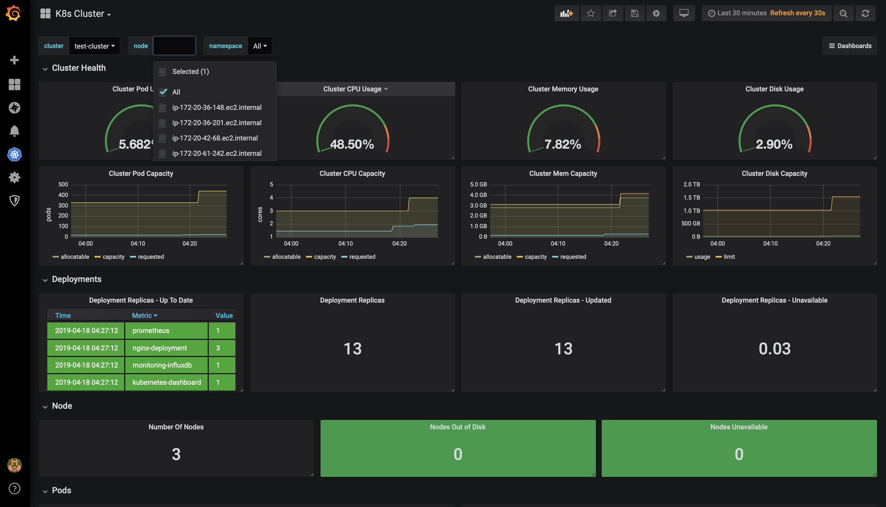
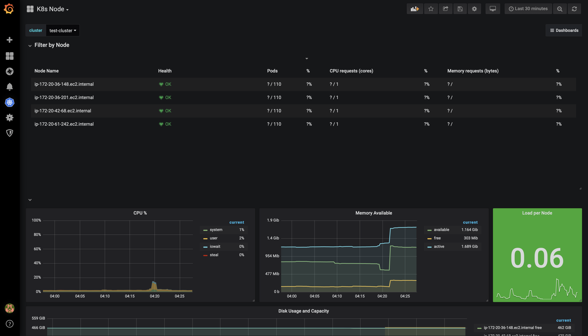

# CSC519-Project

## Milestone 3 - Deployment


| [MILESTONE 1](https://github.ncsu.edu/jnshah2/CSC519-Project/tree/Milestone1) ([Screencast](https://youtu.be/9UFJjtvXmZY)) | [MILESTONE 2](https://github.ncsu.edu/jnshah2/CSC519-Project/tree/Milestone2) ([Screencast](https://youtu.be/lFrX53iuUzw)) | [MILESTONE 3](https://github.ncsu.edu/jnshah2/CSC519-Project/tree/Milestone3) ([Screencast](https://youtu.be/78HHSHWss1I))|


# Content
1. [Our Team](#our-team)
2. [About the Milestone](#about-the-milestone)
3. [Pre-requisites](#prerequisites)
4. [Setup Instructions](#setup-instructions)
	1. [Cloning](#cloning)
	2. [Build and Deployment](#build-and-deployment)
	3. [Infrastructure Upgrade](#infrastructure-upgrade)
	4. [Monitoring Analysis](#monitoring-analysis-something-special-fire)
5. [Report](#report)
6. [Screencast](#screencast)
7. [References](#references)

## Our Team

* Arshdeep Singh Syal ([asyal](mailto:asyal@ncsu.edu))
	* Responsible for implementing the monitoring analysis
* Jubeen Shah ([jnshah2](mailto:jnshah2@ncsu.edu))
	* Responsible for AWS deployment and infrastructure upgrade using Kubernetes and docker + Grafana integration
* Rayan Dasoriya([rdasori](mailto:rdasori@ncsu.edu))
	* Responsible for the feature flags feature using Redis client
* Shraddha Bhadauria([sbhadau](mailto:sbhadau@ncsu.edu))
	* Responsible for implementing the monitoring analysis

## About the milestone

In this milestone, we have extended our work done in [Milestone 2](https://github.ncsu.edu/jnshah2/CSC519-Project/tree/Milestone2) demonstrated techniques related to deployment and monitoring of Checkbox.io and iTrust. We've used Ansible, for spawning AWS instances; Jenkins, for deployment into the production environment; [Kubernetes](https://kubernetes.io/), for making the infrastructure redundant and tolerant to node failures; [Prometheus](https://prometheus.io) and [Grafana](https://grafana.com), for monitoring and analysis.

## Prerequisites
To run this project, you will require the following tools:
1. [Virtualbox](https://www.virtualbox.org/) 
2. [Baker](https://getbaker.io/)
3. [AWS Account](https://aws.amazon.com)

## Setup Instructions

### Cloning

Clone this repository.

```
git clone --branch Milestone3 https://github.ncsu.edu/jnshah2/CSC519-Project.git
```


### Build and Deployment

Before you run the project make sure you enter the values for `Access key ID` and `Secret access key` into the [variables.yml](./variables.yml) by running `ansible-vault edit variables.yml` and entering the password as given in [password.txt](./server/ansible-srv/password.txt).

Go to the CSC519-Project directory `cd CSC519-Project`. To begin with the setup, and run the `run.sh` script by `sh run.sh`. This will automate the following tasks.

* Run `ansible-playbook setUpLocal.yml`
	* This `play` is responsible for instantiating an AWS EC2 Instance which would host the `Jenkins` server and create an `inventory` file for ansible.
	* We have used `ansible-vault` to encrypt the `variables.yml` file for security purposes.
* Run a test `ping` command to ensure that the server can be reached
* Run another `play`, using `ansible-playbook -i inventory playbook.yml`
	* This is responsible for setting up the `Jenkins` server with the required dependecies to enable deployment of [iTrust](https://github.ncsu.edu/engr-csc326-staff/iTrust2-v4) and [Checkbox.io](https://github.com/chrisparnin/checkbox.io) in the production environment.
	* This would also setup [Github Webhooks](https://developer.github.com/webhooks/) to allow us to build the Jenkins Jobs whenever a push is triggered to the repository.
    
In this project, we have used the following ports for different services:

|Service|Port|
|------|--------|
|Checkbox.io| :80 (default)|
|iTrust   | :8080/iTrust2|
|Jenkins | :9999|
|Tomcat  | :8080|
|Grafana |:3000|

#### Old roles from Milestone 2

The roles in red are not used in this milestone, since they were releated to development part of the pipeline. 

```diff
- Build- Running the build job for Checkbox.io and iTrust
- Checkbox - Cloning and configuring the checkbox.io
+ Chrome - Installing headless chrome for iTrust
- Githooks- For creating the post-receive hook on the jenkins server
+ Install-Modules - Installing the prerequisite modules
+ iTrust - Cloning the iTrust Repo
+ Jenkins- Installing and configuring Jenkins
+ JJB]- Jenkins Job Builder
+ Maven- Installing and configuring Maven
- Mongodb- Installing and configuring MongoDB
+ MySQL - Installing and configuring MySQL
- Nginx- Installing and configuring Nginx web server
+ Node - Installing Node.js
- Fuzzer - Used for fuzzing the iTrust code
- Checkbox-Analysis - Used for analyzing the Checkbox.io code
- iTrust-Analysis - Used for analyzing the fuzzed iTrust Code
```
#### New roles for Milestone 3

```diff
+ AWS - Used for setup of the AWS instances
+ Ansible - Used for setup of ansible on the remote server
+ Configure-Jenkins - Used for copying necessary files to the remote server
+ iTrust-Deploy - Used for deploying the iTrust war file on the remote server
+ Kubernetes - Used to setup Kubernetes cluster to host checkbox.io and also setup monitoring and analysis
+ MySQL-Dump - Used for creating a dump of the MySQL database to deploy on the remote server
+ Redis - Used to setup a redis client on the remote server
+ Tomcat - Used to setup Tomcat server to host the iTrust Application.
```
The setup of the Jenkins server should take about 10 minutes to execute. You can then trigger a build event by pushing to `iTrust` repo to initiate the deployment of iTrust, and to `Checkbox.io` repo to initiate the deployment of Checkbox.io cluster with Docker and Kubernetes.

### Infrastructure Upgrade

For this part of the milestone, we used Docker along with Kubernetes to deploy the Checkbox.io service on `three` nodes to make it resistant to node failures. We seperated the rendering for markdown into a seperate microservice, the repo to which can be found [here](https://github.com/jubeenshah/checkbox.io/tree/infra-upgrade).  We then used [AWS Kops](https://aws.amazon.com/blogs/compute/kubernetes-clusters-aws-kops/) to manage the Kubernetes Cluster to deploy the checkbox container that we created on the cluster. The code to docker containers can be found [here](https://github.com/jubeenshah/checkboxdocker).

### Monitoring Analysis... Something special :fire:

In the special component of the milestone we used prometheus to monitor the AWS cluster. The configuration files can be found [here](./roles/kubernetes/files). To setup the prometheus along with Grafana there are a few things that you need to setup. The instructions to which can be found in the kubernetes role page [here](./roles/kubernetes/README.md). We integrated [`Prometheus`](https://prometheus.io) with [`Grafana`](https://grafana.com) to create dashboards that can be seen below. 





You can also look at all the dashboards [here](./roles/kubernetes/README.md#dashboards).

## Report

This was a particular interesting milestone in terms of what we learnt. There were a lot of challenges while we were doing the project, probably only a subset of which were really very easy to solve. We would walk through some of the challenges faced below.
* Deployment Challenges
	* While spawning AWS instances initially we used to hard code the `security group`. For testing the project, when we ran code on a different AWS account, we faced the problem that it could not find the hard-coded Security Group. That was a problem that we overlooked, but quickly resolved by making the script we wrote, also create an security group that the spawned instance would use.
	* We also had to make the inventory file using the script, we wrote so that it can be used with the subsequent playbook.
	* With the `Jenkins` service running on the AWS, we faced issues with the permissions for executing a build job for the jenkins user. Initially we couldn't figure out the problem, because on manually running the ansible playbooks, there was no problem, but with jenkins it was. The resolution was just to assign necessary privileges for the Jenkins user to allow for normal execution.
	* Also, initally when deploying the iTrust service, we used to download the repository on the production server which at first did not seem incorrect. Halfway through the milestone we realized that we had deploy the `.war` file which seemed the logical thing to do in the first place. We had to re-write the deployment strategy for iTrust service.
	* With the new deployment strategy, we took some time before realizing how to migrate a MySQL database from the build server to the deployment server.
* Infrastructure Challenges
	* Initially we didn't seperate the checkbox.io render service as a micro-service. And were still able to make the checkbox.io service to node failures. When, we figured that was not the approach we had to take, we had to re-write the docker containers, and push the changes.
	* Once the containers were ready, and running independent of Kubernetes, on deployment to AWS, the same containers wouldn't run. Turns out it was a security group issue, when necessary ports were not allowed inbound access. Also with kubernetes we had to expose the services themselves.
* Monitroing Analysis Challenges
	* First we wrote `nodejs` scripts that we presumed could run on the nodes and give us the information. Little did we know before the infrastructure upgrade part of the milestone, that for us to deploy `nodejs` scripts that we wrote it either had to be a part of the docker container we already deployed, or create new configuration files for kubernetes. 
	* Slowly we realized that we also had to have a database ready if we wish to have a visualization for the metric we collected. One of the team members had experience with [`InfluxDB`](https://www.influxdata.com) and grafana. Not, looking at whether kubernetes has support for InfluxDB we started modifying the scripts to allow for the integration.
	* Once ready with the new scripts with support for `InfluxDB` and `Grafana` we quickly realized that Kubernetes works best with `Prometheus`, since we faced problems collecting metrics from the Kubernetes cluster.
	* Finally, we settled with `Prometheus` and `Grafana`, collected the necessary configuration files and deployed it Kubernetes. Which worked like a charm.


## Screencast

The screencast for Milestone 3 is available [here](https://youtu.be/78HHSHWss1I).

The screencast for the entire project is available [here](https://youtu.be/zY5L-M_cXSY)

## References

[[1] https://github.com/CSC-DevOps/Course/blob/master/Project/CM.md](https://github.com/CSC-DevOps/Course/blob/master/Project/CM.md "https://github.com/CSC-DevOps/Course/blob/master/Project/CM.md")

[[2] https://jenkins.io/doc/book/getting-started/installing/](https://jenkins.io/doc/book/getting-started/installing/ "https://jenkins.io/doc/book/getting-started/installing/")

[[3] http://docs.ansible.com](http://docs.ansible.com "http://docs.ansible.com")

[[4] https://eksworkshop.com/monitoring/](https://eksworkshop.com/monitoring/)

[[5] https://grafana.com/dashboards/315](https://grafana.com/dashboards/315)

[[6] https://blog.kubernauts.io/cloud-native-monitoring-with-prometheus-and-grafana-9c8003ab9c7 ](https://blog.kubernauts.io/cloud-native-monitoring-with-prometheus-and-grafana-9c8003ab9c7)

[[7] https://medium.com/devopslinks/setup-prometheus-grafana-monitoring-on-kubernetes-cluster-9be4d80a45b1](https://medium.com/devopslinks/setup-prometheus-grafana-monitoring-on-kubernetes-cluster-9be4d80a45b1)

[[8] https://sysdig.com/blog/kubernetes-monitoring-with-prometheus-alertmanager-grafana-pushgateway-part-2/](https://sysdig.com/blog/kubernetes-monitoring-with-prometheus-alertmanager-grafana-pushgateway-part-2/)
