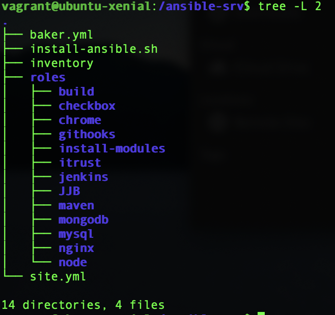
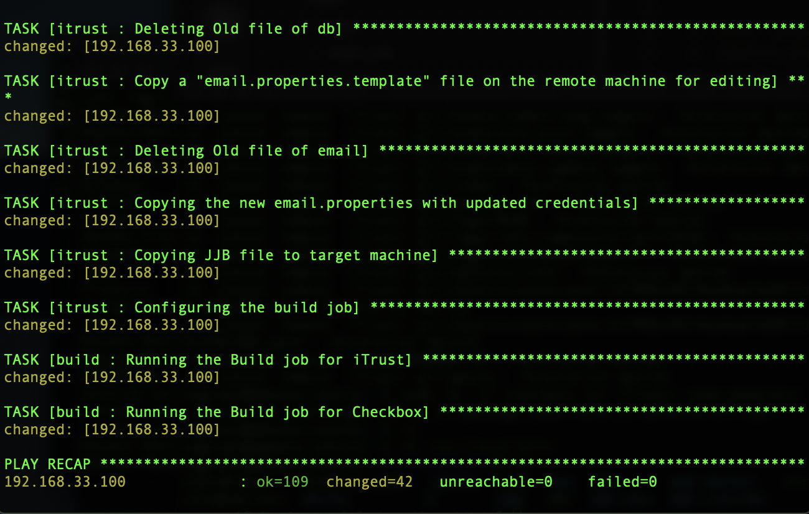
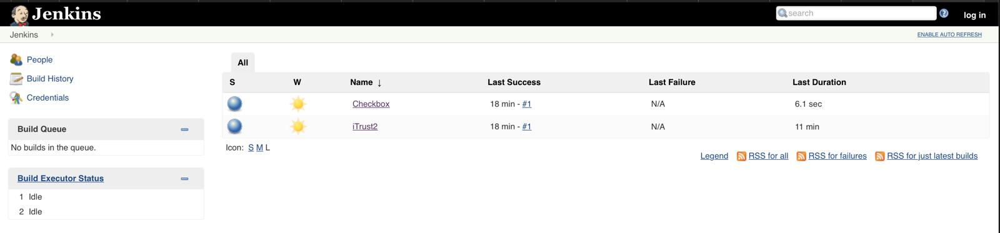

# CSC519-Project

## Milestone 1 - Configuration Management & Build


| [MILESTONE 1](#) | [MILESTONE 2](#) | [MILESTONE 3](#) | [MILESTONE 4](#) |

# Content
1. [Our Team](#our-team)
2. [About the Milestone](#about-the-milestone)
3. [Pre-requisites](#prerequisites)
4. [Setup Instructions](#setup-instructions)
	1. [Cloning](#cloning)
	2. [Build and Deployment](#build-and-deployment)
5. [Report](#report)
6. [Screencast](#screencast)
7. [References](#references)

## Our Team

* Arshdeep Singh Syal ([asyal](mailto:asyal@ncsu.edu))
	* Responsible for Git Hooks integration and README.md write-up
* Jubeen Shah ([jnshah2](mailto:jnshah2@ncsu.edu))
	* Responsible for Jenkins configuration, Checkbox.io and iTrust Build
* Rayan Dasoriya([rdasori](mailto:rdasori@ncsu.edu))
	* Responsible for pm2/mocha tests, iTrust Build and README.md write-up
* Shraddha Bhadauria([sbhadau](mailto:sbhadau@ncsu.edu))
	* Responsible for pm2/mocha tests

## About the milestone

Continuous Delivery (CD) is a software strategy that enables organizations to deliver new features to users as fast and efficiently as possible. The goal of Continuous Delivery is to enable a constant flow of changes into production via an automated software production line. A typical CD pipeline will include the following stages: configuration management and build automation; test automation; and deployment automation.

In this milestone, we have demonstrated the build automation and configuration management using Ansible. We have:

* Provisioned a configuration server ([Ansible](https://www.ansible.com)) and a [Jenkins](https://jenkins.io) server on remote virtual machine instances.
* Configured the Jenkins server, automatically using Ansible.
* Used a [jenkins-job-builder](https://docs.openstack.org/infra/jenkins-job-builder/) and Ansible, to automatically setup build jobs for two applications:
	* A Nodejs web application [`checkbox.io`](https://github.com/chrisparnin/checkbox.io)
	* An "enterprise" Java system [`iTrust`](https://github.ncsu.edu/engr-csc326-staff/iTrust2-v4/tree/master/iTrust2)
* Used a combination of [mocha](https://www.npmjs.com/package/mocha)/[pm2](https://www.npmjs.com/package/pm2), to create a test script that will start and stop the `checkbox.io` service on the server.
* Created a git hook to trigger a build when a push is made to the repo.

## Prerequisites
To run this project, you will require the following tools:
1. [Virtualbox](https://www.virtualbox.org/) (Recommended v5.2.2)
2. [Baker](https://getbaker.io/)

## Setup Instructions

### Cloning

Clone this repository.

```
git clone https://github.ncsu.edu/jnshah2/CSC519-Project.git
```

### Build and Deployment

Go to the CSC519-Project directory `cd CSC519-Project`. To begin with the setup, we have created two local VMs using Baker.

    (i)  Configuration Server (Ansible Server)
    (ii) Jenkins Server
    
To start and stop the server, we can use `sh start-server.sh` and `sh stop-server.sh` respectively. The `start-server.sh` will create the two servers by running `baker bake` and will also generate a public-private key pair(web-srv) which will be used for setting up the connection between the configuration server and the Jenkins server. The `sh destroy-server.sh` will be used to destroy the servers using `baker destroy`.
 
After the successful configuration of the two servers, we will create an SSH connection between the two servers. We will copy the private key (web-srv) generated in the jenkins-srv folder, do `baker ssh` and then paste it in a newly created web-srv (`vi ~/.ssh/web-srv`) file inside the .ssh folder inside configuration server. Change the permission of the private key using the command:

```
chmod 600 ~/.ssh/web-srv
```

Now, copy the public key (web-srv.pub) generated in the jenkins-srv folder, do `baker ssh` and paste it in the authorized_keys file inside the .ssh folder (`vi ~/.ssh/authorized_keys`) in the Jenkins server.

We have setup an ssh access from the configuration server to the Jenkins server. To test this, run the following command from the configuration server:

```
ssh -i ~/.ssh/web-srv vagrant@192.168.33.100
```


In this project, we have used the following ports for different services:
* checkbox.io- :80 (default)
* iTrust- :8080 
* jenkins - :9999

Now, from the ansible-srv folder inside the configuration server, we run our site.yml file. The `site.yml` file contains several roles.



1. [build](./server/ansible-srv/roles/build) - Running the build job for Checkbox.io and iTrust
2. [checkbox](./server/ansible-srv/roles/checkbox) - Cloning and configuring the checkbox.io
3. [chrome](./server/ansible-srv/roles/chrome) - Installing headless chrome for iTrust
4. [githooks](./server/ansible-srv/roles/githooks) - For creating the post-receive hook on the jenkins server
5. [install-modules](./server/ansible-srv/roles/install-modules) - Installing the prerequisite modules
6. [itrust](./server/ansible-srv/roles/itrust) - Cloning the iTrust Repo
7. [jenkins](./server/ansible-srv/roles/jenkins) - Installing and configuring Jenkins
8. [JJB](./server/ansible-srv/roles/jjb) - Jenkins Job Builder
9. [maven](./server/ansible-srv/roles/maven) - Installing and configuring Maven
10. [mongodb](./server/ansible-srv/roles/mongodb) - Installing and configuring MongoDB
11. [mysql](./server/ansible-srv/roles/mysql) - Installing and configuring MySQL
12. [nginx](./server/ansible-srv/roles/nginx)  - Installing and configuring Nginx web server
13. [node](./server/ansible-srv/roles/node) - Installing Node.js

We will run the site.yml file with the inventory(to target the Jenkins server) to install these dependencies and run the build for checkbox.io and iTrust. We use the following command:

```
ansible-playbook site.yml -i inventory
```

If we are running the site.yml file twice, we have to use the `skip-tags` to ensure the idempotency of the system. If you are running the file more than once, we recommend this command to avoid the build failures:

```
ansible-playbook site.yml -i inventory --skip-tags "run_once" 
```

A snippet of the successful completion of the ansible playbook is illustrayted below:



We can also verify if the jenkins server has been deployed and the build is successful, by opening the web browser at [http://192.168.33.100:9999](http://192.168.33.100:9999)



## Report

We faced the following set of difficulties while configuring the jenkins server. Starting off with the project was challenging, as we couldn't find clear requirements for `checkbox.io` and `itrust`. This became clear, once some attention was paid to the actual implementation of the different applications. Once we understood the dependencies and initial setup requirements, it was fairly straightforward implementation for both of the applications. What we noticed is that, though the initial configuration of the jenkins server, that is, the setup and configuration of Jenkins itself, along with other dependencies were not very difficult and we were done with a mjority of the project well before the deadline, we were stuck with simple tasks such as -- the mocha and pm2 test cases, which took us sometime to understand and then implement.

We also faced difficulties while implementing GitHooks because we were not able to clearly understand the requirement itself. Though it was clearly mentioned that the push to the local bare repository were `itrust` and `checkbox` while implementing we thought it was _this_ repository that we needed to make the push to, which would then trigger the build for the two applications. Once the placement of the git hooks was understood, we were confused as to the placement of the `post-receive` hook itself. We first thought, that the git hooks were to be placed in the itrust, and checkbox repositroy itself, but which was not the case. 

## Screencast

The screencast for Milestone 1 is available [here](https://youtu.be/9UFJjtvXmZY).

## References

[[1] https://github.com/CSC-DevOps/Course/blob/master/Project/CM.md](https://github.com/CSC-DevOps/Course/blob/master/Project/CM.md "https://github.com/CSC-DevOps/Course/blob/master/Project/CM.md")

[[2] https://jenkins.io/doc/book/getting-started/installing/](https://jenkins.io/doc/book/getting-started/installing/ "https://jenkins.io/doc/book/getting-started/installing/")

[[3] http://docs.ansible.com](http://docs.ansible.com "http://docs.ansible.com")<br/><br/>
