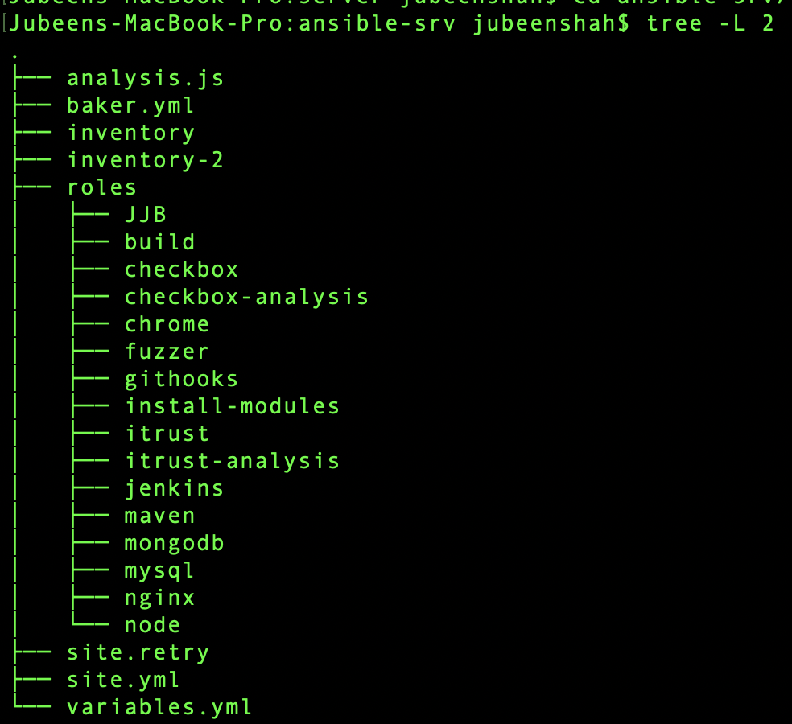

# CSC519-Project

## Milestone 3 - Deployment


| [MILESTONE 1](https://github.ncsu.edu/jnshah2/CSC519-Project/tree/Milestone1) | [MILESTONE 2](https://github.ncsu.edu/jnshah2/CSC519-Project/tree/Milestone2) | [MILESTONE 3](https://github.ncsu.edu/jnshah2/CSC519-Project/tree/Milestone3) |

# Content
1. [Our Team](#our-team)
2. [About the Milestone](#about-the-milestone)
3. [Pre-requisites](#prerequisites)
4. [Setup Instructions](#setup-instructions)
	1. [Cloning](#cloning)
	2. [Build and Deployment](#build-and-deployment)
	3. [Test and Analysis](#test-and-analysis)
5. [Report](#report)
6. [Screencast](#screencast)
7. [References](#references)

## Our Team

* Arshdeep Singh Syal ([asyal](mailto:asyal@ncsu.edu))
	* Responsible for Checkbox analysis code (Long method, Cyclomatic Complexity, Max if conditions, parameter count)
* Jubeen Shah ([jnshah2](mailto:jnshah2@ncsu.edu))
	* Responsible for Jenkins Configuration, iTrust Fuzzing, iTrust Code Coverage, Checkbox analysis for max nesting depth, extending iTrust Build Job, test cases description for Checkbox.
* Rayan Dasoriya([rdasori](mailto:rdasori@ncsu.edu))
	* Responsible for Test prioritization analysis and report creation
* Shraddha Bhadauria([sbhadau](mailto:sbhadau@ncsu.edu))
	* Responsible for Checkbox analysis code (Long method, Cyclomatic Complexity, Max if conditions, parameter count)

## About the milestone

In this milestone, we have extended our work done in [Milestone 2](https://github.ncsu.edu/jnshah2/CSC519-Project/tree/Milestone2) demonstrated techniques related to tetsing and analysis of checkbox.io and iTrust. 

## Prerequisites
To run this project, you will require the following tools:
1. [Virtualbox](https://www.virtualbox.org/) (Recommended v5.2.2)
2. [Baker](https://getbaker.io/)
3. [Cloud Services](#)
4. [Kubernetes](https://kubernetes.io/)

## Setup Instructions

### Cloning

Clone this repository.

```
git clone --branch Milestone2 https://github.ncsu.edu/jnshah2/CSC519-Project.git
```

### Build and Deployment

Go to the CSC519-Project directory `cd CSC519-Project`. To begin with the setup, we have created two local VMs using Baker.

    (i)  Configuration Server (Ansible Server)
    (ii) Jenkins Server
    
To start and stop the server, we can use `sh start-server.sh` and `sh stop-server.sh` respectively. The `start-server.sh` will create the two servers by running `baker bake` and will also generate a public-private key pair(web-srv) which will be used for setting up the connection between the configuration server and the Jenkins server. The `sh destroy-server.sh` will be used to destroy the servers using `baker destroy`.
 
After the successful configuration of the two servers, we will create an SSH connection between the two servers. We will copy the private key (web-srv) generated in the jenkins-srv folder, do `baker ssh` and then paste it in a newly created web-srv (`vi ~/.ssh/web-srv`) file inside the .ssh folder inside configuration server. Change the permission of the private key using the command:

```
chmod 600 ~/.ssh/web-srv
```

Now, copy the public key (web-srv.pub) generated in the jenkins-srv folder, do `baker ssh` and paste it in the authorized_keys file inside the .ssh folder (`vi ~/.ssh/authorized_keys`) in the Jenkins server.

We have setup an ssh access from the configuration server to the Jenkins server. To test this, run the following command from the configuration server:

```
ssh -i ~/.ssh/web-srv vagrant@192.168.33.100
```

In this project, we have used the following ports for different services:
* checkbox.io- :80 (default)
* iTrust- :8080 
* jenkins - :9999

Now, from the ansible-srv folder inside the configuration server, we run our playbook.yml file. The `playbook.yml` file contains several roles.



#### Old roles from Milestone 2

1. [build](./server/ansible-srv/roles/build) - Running the build job for Checkbox.io and iTrust
2. [checkbox](./server/ansible-srv/roles/checkbox) - Cloning and configuring the checkbox.io
3. [chrome](./server/ansible-srv/roles/chrome) - Installing headless chrome for iTrust
4. [githooks](./server/ansible-srv/roles/githooks) - For creating the post-receive hook on the jenkins server
5. [install-modules](./server/ansible-srv/roles/install-modules) - Installing the prerequisite modules
6. [itrust](./server/ansible-srv/roles/itrust) - Cloning the iTrust Repo
7. [jenkins](./server/ansible-srv/roles/jenkins) - Installing and configuring Jenkins
8. [JJB](./server/ansible-srv/roles/jjb) - Jenkins Job Builder
9. [maven](./server/ansible-srv/roles/maven) - Installing and configuring Maven
10. [mongodb](./server/ansible-srv/roles/mongodb) - Installing and configuring MongoDB
11. [mysql](./server/ansible-srv/roles/mysql) - Installing and configuring MySQL
12. [nginx](./server/ansible-srv/roles/nginx)  - Installing and configuring Nginx web server
13. [node](./server/ansible-srv/roles/node) - Installing Node.js
14. [Fuzzer](https://github.ncsu.edu/jnshah2/CSC519-Project/tree/Milestone2/server/ansible-srv/roles/fuzzer)
15. [Checkbox-Analysis](https://github.ncsu.edu/jnshah2/CSC519-Project/tree/Milestone2/server/ansible-srv/roles/checkbox-analysis)
16. [iTrust-Analysis](https://github.ncsu.edu/jnshah2/CSC519-Project/tree/Milestone2/server/ansible-srv/roles/itrust-analysis)

#### New roles from Milestone 3

17.
18. 

We will run the `playbook.yml` file with the inventory (to target the Jenkins server) to install these dependencies and run the build for checkbox.io and iTrust. There is also a [`variables.yml`](https://github.ncsu.edu/jnshah2/CSC519-Project/blob/Milestone3/server/ansible-srv/variables.yml) file with a list of all the variables that we have used throughout the play. We use the following command:

```
ansible-playbook playbook.yml -i inventory
```
A snippet of the successful completion of the ansible playbook is added below:


Once complete, the jenkins server will be available at [192.168.33.100:9999](http://192.168.33.100:9999)


### Test and Analysis
 
 The new roles, intrdoced in this Milestone, are described in the previous section, [here](#new-roles-from-milestone-3).
 
 In this Milestone, we have completed the following tasks:


## Report


## Screencast

The screencast for Milestone 3 is available [here]().

## References

[[1] https://github.com/CSC-DevOps/Course/blob/master/Project/CM.md](https://github.com/CSC-DevOps/Course/blob/master/Project/CM.md "https://github.com/CSC-DevOps/Course/blob/master/Project/CM.md")

[[2] https://jenkins.io/doc/book/getting-started/installing/](https://jenkins.io/doc/book/getting-started/installing/ "https://jenkins.io/doc/book/getting-started/installing/")

[[3] http://docs.ansible.com](http://docs.ansible.com "http://docs.ansible.com")<br/>
