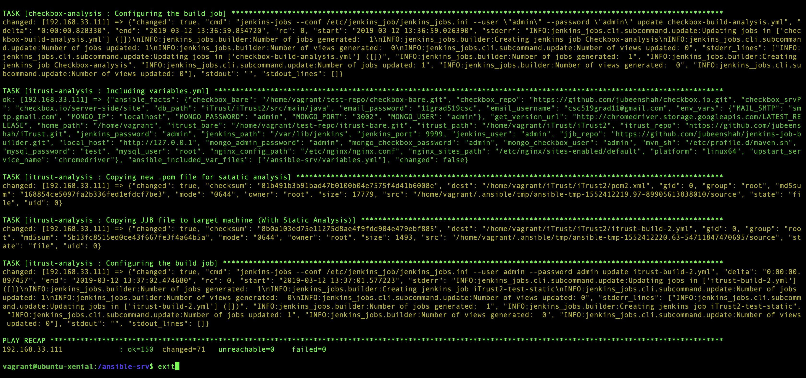

# CSC519-Project

## Milestone 2 - Test & Analysis


| [MILESTONE 1](https://github.ncsu.edu/jnshah2/CSC519-Project/tree/Milestone1) | [MILESTONE 2](https://github.ncsu.edu/jnshah2/CSC519-Project/tree/Milestone2) | [MILESTONE 3](#) | [MILESTONE 4](#) |

# Content
1. [Our Team](#our-team)
2. [About the Milestone](#about-the-milestone)
3. [Pre-requisites](#prerequisites)
4. [Setup Instructions](#setup-instructions)
	1. [Cloning](#cloning)
	2. [Build and Deployment](#build-and-deployment)
5. [Report](#report)
6. [Screencast](#screencast)
7. [References](#references)

## Our Team

* Arshdeep Singh Syal ([asyal](mailto:asyal@ncsu.edu))
	* Responsible for Checkbox analysis code (Long method, Cyclomatic Complexity, Max if conditions, parameter count)
* Jubeen Shah ([jnshah2](mailto:jnshah2@ncsu.edu))
	* Responsible for Jenkins Configuration, iTrust Fuzzing, iTrust Code Coverage, Checkbox analysis for max nesting depth, extending iTrust Build Job, test cases description for Checkbox.
* Rayan Dasoriya([rdasori](mailto:rdasori@ncsu.edu))
	* Responsible for Test prioritization analysis and report creation
* Shraddha Bhadauria([sbhadau](mailto:sbhadau@ncsu.edu))
	* Responsible for Checkbox analysis code (Long method, Cyclomatic Complexity, Max if conditions, parameter count)

## About the milestone

In this milestone, we have extended our work done in [Milestone 1](https://github.ncsu.edu/jnshah2/CSC519-Project/tree/Milestone1) demonstrated techniques related to fuzzing, test case priorization, and static analysis to improve the quality of checkbox.io and iTrust. We have:

* Installed a [Jacoco](https://wiki.jenkins.io/display/JENKINS/JaCoCo+Plugin) plugin in jenkins for Java Code Coverage for the iTrust Application. 
	* This measures coverage and display a report within Jenkins on every push to the bare repository, since in the last Milestone, we configured a post-receive hook to start a iTrust Build on Jenkins on port 9999.
* We also developed a tool that automatically commits new random changes to source code which will trigger a build and run of the test suite. We simply used a pseudo-random generator with a seed value ranging from `1` to `100`. The code for the same can be found [here](https://github.ncsu.edu/jnshah2/CSC519-Project/blob/Milestone2/server/ansible-srv/roles/fuzzer/files/main.js), and [here](https://github.ncsu.edu/jnshah2/CSC519-Project/blob/Milestone2/server/ansible-srv/roles/fuzzer/files/loop.sh). We made the following changes : 
	* Changed content of some `strings` in code to `"CSC519-Devops_String"`
	* Swapped `">"`/`">="` and with `"<"`/`"<="` and vice versa
	* Swapped `"=="` with `"!="` and vice versa
	* Swapped `0` with `1` and vice versa
* We also, wrote an [analysis script](https://github.ncsu.edu/jnshah2/CSC519-Project/blob/Milestone2/server/ansible-srv/roles/fuzzer/files/analysis.py) that would analyze the results from the 100 build jobs, and create a report.
* We modified the [pom.xml](https://github.ncsu.edu/jnshah2/CSC519-Project/blob/Milestone2/server/ansible-srv/roles/itrust-analysis/files/pom.xml) file with support for [`FindBugs`](http://findbugs.sourceforge.net) for a new job `iTrust2-test-static` to be started on jenkins, the Jenkins Job Builder file can be found [here](https://github.ncsu.edu/jnshah2/CSC519-Project/blob/Milestone2/server/ansible-srv/roles/itrust-analysis/files/itrust-build-2.yml).
	* We also installed a [FindBugs Plugin](https://wiki.jenkins.io/display/JENKINS/FindBugs+Plugin) to support the same.
	* We tried to use the [Warning Next Generation Plugin](https://wiki.jenkins.io/display/JENKINS/Warnings+Next+Generation+Plugin), but JJB, does not yet support the this plugin, but on manual running it worked, so when JJB starts the support, a simple publisher code should help with the same.
	* Also, with the [build file](https://github.ncsu.edu/jnshah2/CSC519-Project/blob/Milestone2/server/ansible-srv/roles/itrust-analysis/files/itrust-build-2.yml), we're not failing the build, this is simulated in the screencast, but just needs the altering of the threshold values.
* Extended the checkbox.io and to analyze and [create custom metrics](https://github.ncsu.edu/jnshah2/CSC519-Project/blob/Milestone2/server/ansible-srv/roles/checkbox-analysis/files/analysis.js) for the same. Then used a [test script](https://github.ncsu.edu/jnshah2/CSC519-Project/blob/Milestone2/server/ansible-srv/roles/checkbox-analysis/files/test.js) to fail a build when necessary. The following metrics are calculated
	* `Long Method`, failing the build  when a method is longer than 100 lines
	* `Cyclomatic Complexity`, failing the build when the number of conditional or looping statements is greater than 15
	* `Max If Conditions`, failing the build when the number of conditions in the if statement are greater than 15.
	* `Max Parameter Count`, failing the build when the maximum number of parameters passed within a function is greater than 10.
	* `Max Nesting Depth`, failing the build when the maximum depth of if/else conditons is greater than 15.

## Prerequisites
To run this project, you will require the following tools:
1. [Virtualbox](https://www.virtualbox.org/) (Recommended v5.2.2)
2. [Baker](https://getbaker.io/)

## Setup Instructions

### Cloning

Clone this repository.

```
git clone https://github.ncsu.edu/jnshah2/CSC519-Project.git
```

### Build and Deployment

Go to the CSC519-Project directory `cd CSC519-Project`. To begin with the setup, we have created two local VMs using Baker.

    (i)  Configuration Server (Ansible Server)
    (ii) Jenkins Server
    
To start and stop the server, we can use `sh start-server.sh` and `sh stop-server.sh` respectively. The `start-server.sh` will create the two servers by running `baker bake` and will also generate a public-private key pair(web-srv) which will be used for setting up the connection between the configuration server and the Jenkins server. The `sh destroy-server.sh` will be used to destroy the servers using `baker destroy`.
 
After the successful configuration of the two servers, we will create an SSH connection between the two servers. We will copy the private key (web-srv) generated in the jenkins-srv folder, do `baker ssh` and then paste it in a newly created web-srv (`vi ~/.ssh/web-srv`) file inside the .ssh folder inside configuration server. Change the permission of the private key using the command:

```
chmod 600 ~/.ssh/web-srv
```

Now, copy the public key (web-srv.pub) generated in the jenkins-srv folder, do `baker ssh` and paste it in the authorized_keys file inside the .ssh folder (`vi ~/.ssh/authorized_keys`) in the Jenkins server.

We have setup an ssh access from the configuration server to the Jenkins server. To test this, run the following command from the configuration server:

```
ssh -i ~/.ssh/web-srv vagrant@192.168.33.100
```


In this project, we have used the following ports for different services:
* checkbox.io- :80 (default)
* iTrust- :8080 
* jenkins - :9999

Now, from the ansible-srv folder inside the configuration server, we run our site.yml file. The `site.yml` file contains several roles.


1. [build](./server/ansible-srv/roles/build) - Running the build job for Checkbox.io and iTrust
2. [checkbox](./server/ansible-srv/roles/checkbox) - Cloning and configuring the checkbox.io
3. [chrome](./server/ansible-srv/roles/chrome) - Installing headless chrome for iTrust
4. [githooks](./server/ansible-srv/roles/githooks) - For creating the post-receive hook on the jenkins server
5. [install-modules](./server/ansible-srv/roles/install-modules) - Installing the prerequisite modules
6. [itrust](./server/ansible-srv/roles/itrust) - Cloning the iTrust Repo
7. [jenkins](./server/ansible-srv/roles/jenkins) - Installing and configuring Jenkins
8. [JJB](./server/ansible-srv/roles/jjb) - Jenkins Job Builder
9. [maven](./server/ansible-srv/roles/maven) - Installing and configuring Maven
10. [mongodb](./server/ansible-srv/roles/mongodb) - Installing and configuring MongoDB
11. [mysql](./server/ansible-srv/roles/mysql) - Installing and configuring MySQL
12. [nginx](./server/ansible-srv/roles/nginx)  - Installing and configuring Nginx web server
13. [node](./server/ansible-srv/roles/node) - Installing Node.js

We will run the site.yml file with the inventory(to target the Jenkins server) to install these dependencies and run the build for checkbox.io and iTrust. We use the following command:

```
ansible-playbook site.yml -i inventory
```

If we are running the site.yml file twice, we have to use the `skip-tags` to ensure the idempotency of the system. If you are running the file more than once, we recommend this command to avoid the build failures:

```
ansible-playbook site.yml -i inventory --skip-tags "run_once" 
```

A snippet of the successful completion of the ansible playbook is illustrayted below:



To run the build, comment out all the roles in the site.yml file and uncomment the `build` role. We can also verify if the jenkins server has been deployed and the build is successful, by opening the web browser at [http://192.168.33.100:9999](http://192.168.33.100:9999)


## Report

We faced the following set of difficulties while configuring the jenkins server. Starting off with the project was challenging, as we couldn't find clear requirements for `checkbox.io` and `itrust`. This became clear, once some attention was paid to the actual implementation of the different applications. Once we understood the dependencies and initial setup requirements, it was fairly straightforward implementation for both of the applications. What we noticed is that, though the initial configuration of the jenkins server, that is, the setup and configuration of Jenkins itself, along with other dependencies were not very difficult and we were done with a mjority of the project well before the deadline, we were stuck with simple tasks such as -- the mocha and pm2 test cases, which took us sometime to understand and then implement.

We also faced difficulties while implementing GitHooks because we were not able to clearly understand the requirement itself. Though it was clearly mentioned that the push to the local bare repository were `itrust` and `checkbox` while implementing we thought it was _this_ repository that we needed to make the push to, which would then trigger the build for the two applications. Once the placement of the git hooks was understood, we were confused as to the placement of the `post-receive` hook itself. We first thought, that the git hooks were to be placed in the itrust, and checkbox repositroy itself, but which was not the case. 

## Screencast

The screencast for Milestone 1 is available [here](https://youtu.be/9UFJjtvXmZY).

## References

[[1] https://github.com/CSC-DevOps/Course/blob/master/Project/CM.md](https://github.com/CSC-DevOps/Course/blob/master/Project/CM.md "https://github.com/CSC-DevOps/Course/blob/master/Project/CM.md")

[[2] https://jenkins.io/doc/book/getting-started/installing/](https://jenkins.io/doc/book/getting-started/installing/ "https://jenkins.io/doc/book/getting-started/installing/")

[[3] http://docs.ansible.com](http://docs.ansible.com "http://docs.ansible.com")<br/>
