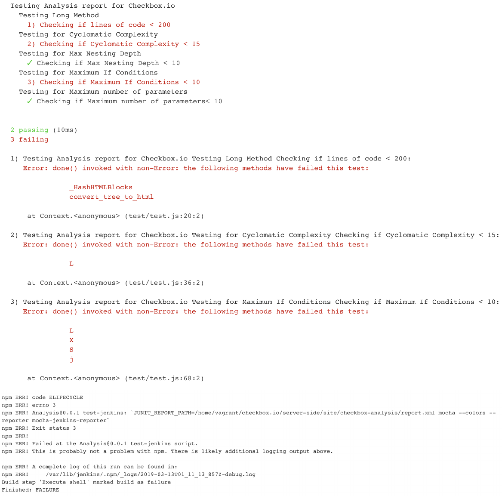

# CSC519-Project

## Milestone 2 - Test & Analysis


| [MILESTONE 1](https://github.ncsu.edu/jnshah2/CSC519-Project/tree/Milestone1) | [MILESTONE 2](https://github.ncsu.edu/jnshah2/CSC519-Project/tree/Milestone2) | [MILESTONE 3](#) | [MILESTONE 4](#) |

# Content
1. [Our Team](#our-team)
2. [About the Milestone](#about-the-milestone)
3. [Pre-requisites](#prerequisites)
4. [Setup Instructions](#setup-instructions)
	1. [Cloning](#cloning)
	2. [Build and Deployment](#build-and-deployment)
	3. [Test and Analysis](#test-and-analysis)
5. [Report](#report)
6. [Screencast](#screencast)
7. [References](#references)

## Our Team

* Arshdeep Singh Syal ([asyal](mailto:asyal@ncsu.edu))
	* Responsible for Checkbox analysis code (Long method, Cyclomatic Complexity, Max if conditions, parameter count)
* Jubeen Shah ([jnshah2](mailto:jnshah2@ncsu.edu))
	* Responsible for Jenkins Configuration, iTrust Fuzzing, iTrust Code Coverage, Checkbox analysis for max nesting depth, extending iTrust Build Job, test cases description for Checkbox.
* Rayan Dasoriya([rdasori](mailto:rdasori@ncsu.edu))
	* Responsible for Test prioritization analysis and report creation
* Shraddha Bhadauria([sbhadau](mailto:sbhadau@ncsu.edu))
	* Responsible for Checkbox analysis code (Long method, Cyclomatic Complexity, Max if conditions, parameter count)

## About the milestone

In this milestone, we have extended our work done in [Milestone 1](https://github.ncsu.edu/jnshah2/CSC519-Project/tree/Milestone1) demonstrated techniques related to fuzzing, test case priorization, and static analysis to improve the quality of checkbox.io and iTrust. 

## Prerequisites
To run this project, you will require the following tools:
1. [Virtualbox](https://www.virtualbox.org/) (Recommended v5.2.2)
2. [Baker](https://getbaker.io/)

## Setup Instructions

### Cloning

Clone this repository.

```
git clone --branch Milestone2 https://github.ncsu.edu/jnshah2/CSC519-Project.git
```

### Build and Deployment

Go to the CSC519-Project directory `cd CSC519-Project`. To begin with the setup, we have created two local VMs using Baker.

    (i)  Configuration Server (Ansible Server)
    (ii) Jenkins Server
    
To start and stop the server, we can use `sh start-server.sh` and `sh stop-server.sh` respectively. The `start-server.sh` will create the two servers by running `baker bake` and will also generate a public-private key pair(web-srv) which will be used for setting up the connection between the configuration server and the Jenkins server. The `sh destroy-server.sh` will be used to destroy the servers using `baker destroy`.
 
After the successful configuration of the two servers, we will create an SSH connection between the two servers. We will copy the private key (web-srv) generated in the jenkins-srv folder, do `baker ssh` and then paste it in a newly created web-srv (`vi ~/.ssh/web-srv`) file inside the .ssh folder inside configuration server. Change the permission of the private key using the command:

```
chmod 600 ~/.ssh/web-srv
```

Now, copy the public key (web-srv.pub) generated in the jenkins-srv folder, do `baker ssh` and paste it in the authorized_keys file inside the .ssh folder (`vi ~/.ssh/authorized_keys`) in the Jenkins server.

We have setup an ssh access from the configuration server to the Jenkins server. To test this, run the following command from the configuration server:

```
ssh -i ~/.ssh/web-srv vagrant@192.168.33.100
```

In this project, we have used the following ports for different services:
* checkbox.io- :80 (default)
* iTrust- :8080 
* jenkins - :9999

Now, from the ansible-srv folder inside the configuration server, we run our playbook.yml file. The `playbook.yml` file contains several roles.


#### Old roles from Milestone 1

1. [build](./server/ansible-srv/roles/build) - Running the build job for Checkbox.io and iTrust
2. [checkbox](./server/ansible-srv/roles/checkbox) - Cloning and configuring the checkbox.io
3. [chrome](./server/ansible-srv/roles/chrome) - Installing headless chrome for iTrust
4. [githooks](./server/ansible-srv/roles/githooks) - For creating the post-receive hook on the jenkins server
5. [install-modules](./server/ansible-srv/roles/install-modules) - Installing the prerequisite modules
6. [itrust](./server/ansible-srv/roles/itrust) - Cloning the iTrust Repo
7. [jenkins](./server/ansible-srv/roles/jenkins) - Installing and configuring Jenkins
8. [JJB](./server/ansible-srv/roles/jjb) - Jenkins Job Builder
9. [maven](./server/ansible-srv/roles/maven) - Installing and configuring Maven
10. [mongodb](./server/ansible-srv/roles/mongodb) - Installing and configuring MongoDB
11. [mysql](./server/ansible-srv/roles/mysql) - Installing and configuring MySQL
12. [nginx](./server/ansible-srv/roles/nginx)  - Installing and configuring Nginx web server
13. [node](./server/ansible-srv/roles/node) - Installing Node.js

#### New roles from Milestone 2

14. [Fuzzer](https://github.ncsu.edu/jnshah2/CSC519-Project/tree/Milestone2/server/ansible-srv/roles/fuzzer)
15. [Checkbox-Analysis](https://github.ncsu.edu/jnshah2/CSC519-Project/tree/Milestone2/server/ansible-srv/roles/checkbox-analysis)
16. [iTrust-Analysis](https://github.ncsu.edu/jnshah2/CSC519-Project/tree/Milestone2/server/ansible-srv/roles/itrust-analysis)

We will run the `site.yml` file with the inventory (to target the Jenkins server) to install these dependencies and run the build for checkbox.io and iTrust. There is also a [`variables.yml`](https://github.ncsu.edu/jnshah2/CSC519-Project/blob/Milestone2/server/ansible-srv/variables.yml) file with a list of all the variables that we have used throughout the play. We use the following command:

```
ansible-playbook playbook.yml -i inventory
```
A snippet of the successful completion of the ansible playbook is added below:


Once complete, the jenkins server will be available at [192.168.33.100:9999](http://192.168.33.100:9999)


### Test and Analysis
 
 The new roles, intrdoced in this Milestone, are described in the previous section, [here](#new-roles-from-milestone-2).
 
 In this Milestone we have completed the following tasks:

* Installed a [Jacoco](https://wiki.jenkins.io/display/JENKINS/JaCoCo+Plugin) plugin in jenkins for Java Code Coverage for the iTrust Application. 
	* This measures coverage and display a report within Jenkins on every push to the bare repository, since in the last Milestone, we configured a post-receive hook to start a iTrust Build on Jenkins on port 9999.
	
* We also developed a tool that automatically commits new random changes to source code which will trigger a build and run of the test suite. We simply used a pseudo-random generator with a seed value ranging from `1` to `100`. The code for the same can be found [here](https://github.ncsu.edu/jnshah2/CSC519-Project/blob/Milestone2/server/ansible-srv/roles/fuzzer/files/main.js), and [here](https://github.ncsu.edu/jnshah2/CSC519-Project/blob/Milestone2/server/ansible-srv/roles/fuzzer/files/loop.sh). We made the following changes : 
	* Changed content of some `strings` in code to `"CSC519-Devops_String"`
	* Swapped `">"`/`">="` and with `"<"`/`"<="` and vice versa
	* Swapped `"=="` with `"!="` and vice versa
	* Swapped `0` with `1` and vice versa
	

	
* We also, wrote an [analysis script](https://github.ncsu.edu/jnshah2/CSC519-Project/blob/Milestone2/server/ansible-srv/roles/fuzzer/files/analysis.py) that would analyze the results from the 100 build jobs, and create a report. The results from the build report is saved [here](./resources/Analysis-report/itrust-result.txt), and the changes made in each build is saved [here](./resources/Analysis-report/build-info.txt)
* We modified the [pom.xml](https://github.ncsu.edu/jnshah2/CSC519-Project/blob/Milestone2/server/ansible-srv/roles/itrust-analysis/files/pom.xml) file with support for [`FindBugs`](http://findbugs.sourceforge.net) for a new job `iTrust2-test-static` to be started on jenkins, the Jenkins Job Builder file can be found [here](https://github.ncsu.edu/jnshah2/CSC519-Project/blob/Milestone2/server/ansible-srv/roles/itrust-analysis/files/itrust-build-2.yml).
	* We also installed a [FindBugs Plugin](https://wiki.jenkins.io/display/JENKINS/FindBugs+Plugin) to support the same.
	* We tried to use the [Warning Next Generation Plugin](https://wiki.jenkins.io/display/JENKINS/Warnings+Next+Generation+Plugin), but JJB, does not yet support the this plugin, but on manual running it worked, so when JJB starts the support, a simple publisher code should help with the same.
	* Also, with the [build file](https://github.ncsu.edu/jnshah2/CSC519-Project/blob/Milestone2/server/ansible-srv/roles/itrust-analysis/files/itrust-build-2.yml), we're failing the build, this is simulated in the screencast.


	
* Extended the checkbox.io and to analyze and [create custom metrics](https://github.ncsu.edu/jnshah2/CSC519-Project/blob/Milestone2/server/ansible-srv/roles/checkbox-analysis/files/analysis.js) for the same. Then used a [test script](https://github.ncsu.edu/jnshah2/CSC519-Project/blob/Milestone2/server/ansible-srv/roles/checkbox-analysis/files/test.js) to fail a build when necessary. The following metrics are calculated
	* `Long Method`, failing the build  when a method is longer than 100 lines
	* `Cyclomatic Complexity`, failing the build when the number of conditional or looping statements is greater than 15
	* `Max If Conditions`, failing the build when the number of conditions in the if statement are greater than 15.
	* `Max Parameter Count`, failing the build when the maximum number of parameters passed within a function is greater than 10.
	* `Max Nesting Depth`, failing the build when the maximum depth of if/else conditons is greater than 15.

	

## Report

With Fuzzing, we wanted to the approach to be recreated as and when required, hence we used a `pseudo-random` generator, with a seed value associated with each of the build. Thus it is easier for anyone, to get the same results in the test cases, and errors. Once the seed value is passed, we generate a probability of whether a line has to be modified, and then there is a probability that is associated with each of the fuzing operations. Once the fuzzing operation is completed, we push the code onto Jenkins Server for a build. Once the build is complete, we copy the test files from`surefire-reports` to a different folder, and then another fuzzing operation is queued up. 

Once the hundred builds are built, and all the files collected we wrote an analysis script, that would be responsible for walking through the directories, and compiling information about each build. Some analysis of the errors generated, and the changes that caused the errors are listed below. This is not a comprehensive list, but something that we uncovered while going through the saved results.
* When replacing strings, `email.properties` was changed to `CSC-Devops_string` in `/iTrust/iTrust2/src/main/java/edu/ncsu/csc/itrust2/utils/EmailUtil.java`. This often caused the test to be errored.
* This brings me to the next point, there are a lot of strings in the java files. Even after reducing the probability of line within a file being altered to less than `0.5`, and then adding another condition that limits the fuzzing of string operation to less than 0.035, the average number of strings that were `"fuzzed"` in each build averaged about 7-8 times. Agreed, that most of the strings that were altered, wre a part of a print statement, but there were some strings, that were reading meant for reading certain files.
* There were two tests - `testDrugLookup` and `testDrugForm` that never failed. This was because no fuzzing operation was ever operated on the methods relating to those two tests.
* The `testDiaryEntryInvalid` test failed the most number of times, because it checked if the values set for different parameters like `fats`,`proteins`, `carbohydrates`, etc were ever negative. Since we induced a fuzzing operation that changed the signs of operations from `">"`/`">="` with `"<"`/`"<="` and vice versa the results can be proven accordingly assuring us that the tests are working properly. 
* The next maximum numbers of failed error cases was with `testInvalidCodes` and `testCodeAPI` which accoring to us has a similar explaination as the previous point. Since the `testInvalidCodes` check for values within a specific range, the alteration of the operations from `">"`/`">="` with `"<"`/`"<="` and vice versa caused a majority of those errors.
* Next test we try to analyse is the `testPatientAPI` test, where patient information is tested, again a similar explaination like the previous point. The interesting observation that we had was the alteration of `lastName.length() > 30` to `lastName.length() < 30` at `iTrust/iTrust2/src/main/java/edu/ncsu/csc/itrust2/models/persistent/Patient.java` led to an infinite loop.


## Screencast

The screencast for Milestone 2 is available [here](https://youtu.be/lFrX53iuUzw).

## References

[[1] https://github.com/CSC-DevOps/Course/blob/master/Project/CM.md](https://github.com/CSC-DevOps/Course/blob/master/Project/CM.md "https://github.com/CSC-DevOps/Course/blob/master/Project/CM.md")

[[2] https://jenkins.io/doc/book/getting-started/installing/](https://jenkins.io/doc/book/getting-started/installing/ "https://jenkins.io/doc/book/getting-started/installing/")

[[3] http://docs.ansible.com](http://docs.ansible.com "http://docs.ansible.com")<br/>
