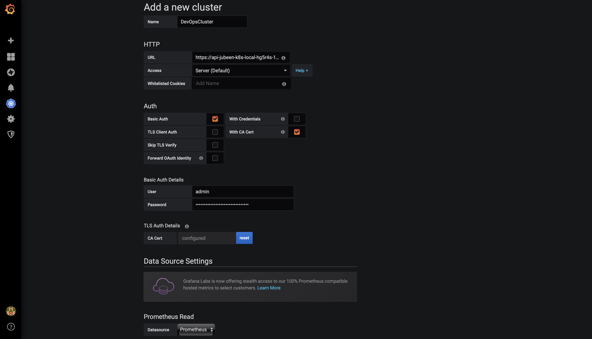

Kubernetes 
=========

In this we're going to briefly explain how to setup the Grafana and Prometheus for your cluster in two easy steps.

Requirements
------------

You can run the [main.yml](./tasks/main.yml) file for your cluster making changes to the `KOPS_CLUSTER_NAME` and `KOPS_STATE_STORE`. You can also make changes to the required [configuration files](./files/) if you need to. Once you have your cluster ready with the deployments, you can follow the following two steps.

Step 1
--------------

Add a `Data Source` in your Grafana Dashboard to `Prometheus` out of the many options that are avilable to you. You can fill in the values as shown in the image below. The port for prometheus database is :9090 and is exposed as `http://prometheus`

Step 2
------------

* `Enable Kubernetes` from your dashboard, and then go to `Add a new Cluster` where you can enter your cluster information. 
	* For example, for me the load balancer endpoint as given by AWS was `https://api-jubeen-k8s.local` which was `KOPS_CLUSTER_NAME` that I set. 
* You can then select access method as `Server (Default)` and then select `Basic Auth` and `With CA cert` in the **Auth** section. 
	* For the username and password for `Basic Auth` would be `admin` and the value you get from running `kops get secrets kube --type secret -oplaintext` command. 
	* You can then find the CA cert in your `AWS S3` bucket under the `issued` folder.

That's it, you can now view the cluster information on your dashboards. Some example images for the dashboard are shown below.

Dashboards
-------------

Author Information
------------------

Jubeen Shah
